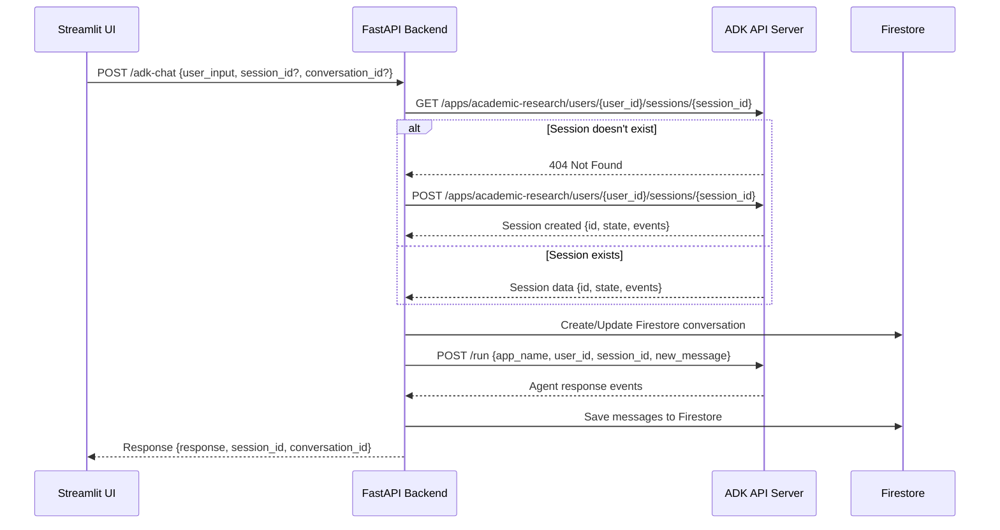

# ADK Chatbot Architecture Documentation

## 🏗️ System Overview

This document describes the architecture of the Knowledge Surf chatbot system that integrates Google ADK (Agent Development Kit) with a FastAPI backend and Streamlit frontend.

## 📊 Architecture Diagram

```
┌─────────────────┐    ┌─────────────────┐    ┌─────────────────┐
│   Streamlit UI  │    │  FastAPI Backend│    │  ADK API Server │
│   (Port 8501)   │    │   (Port 8080)   │    │   (Port 8000)   │
└─────────────────┘    └─────────────────┘    └─────────────────┘
         │                       │                       │
         │ HTTP Requests         │ HTTP Requests        │
         │ /adk-chat            │ /run, /run_sse       │
         │ /conversations       │ /apps/{agent}/...    │
         └───────────────────────┼───────────────────────┘
                                │
                    ┌─────────────────┐
                    │   Firestore DB  │
                    │ (Conversations) │
                    └─────────────────┘
```

## 🔄 Session Management Flow

### 1. Session Creation Handshake



### 2. Dual Session Management

The system maintains **two types of sessions**:

#### ADK Sessions (Agent Context)
- **Purpose**: Maintain agent conversation context and state
- **Managed by**: ADK API Server
- **Storage**: In-memory (ADK server)
- **Scope**: Agent-specific conversation flow
- **Lifecycle**: Persists until ADK server restart or explicit deletion

#### Firestore Conversations (UI Persistence)
- **Purpose**: Store conversation history for UI display
- **Managed by**: FastAPI Backend
- **Storage**: Firestore Database
- **Scope**: User conversation management
- **Lifecycle**: Persistent across sessions and server restarts

## 🔧 Component Details

### 1. Streamlit Frontend (Port 8501)

**Key Features:**
- AI Model selection (ADK vs Gemini Direct)
- Conversation management UI
- File upload support
- Real-time chat interface

**Session State Management:**
```python
st.session_state.use_adk = True  # AI model selection
st.session_state.adk_session_id = None  # ADK session tracking
st.session_state.current_conversation_id = None  # Firestore conversation
st.session_state.messages = []  # UI message display
```

**API Calls:**
- `POST /adk-chat` - Send messages to ADK agent
- `GET /conversations` - Load conversation history
- `POST /upload` - File uploads

### 2. FastAPI Backend (Port 8080)

**Core Services:**
- `ADKService` - Wraps ADK API endpoints
- `FirestoreService` - Manages conversation persistence
- `AuthService` - User authentication

**Key Endpoints:**

#### `/adk-chat` (POST)
```json
{
  "user_input": "string",
  "session_id": "optional_uuid",
  "conversation_id": "optional_uuid", 
  "streaming": false
}
```

**Response:**
```json
{
  "response": "agent_response_text",
  "session_id": "adk_session_uuid",
  "conversation_id": "firestore_conversation_uuid",
  "events": [...] // Full ADK events for debugging
}
```

#### Session Management Endpoints:
- `GET /adk-sessions/{session_id}` - Get ADK session details
- `DELETE /adk-sessions/{session_id}` - Delete ADK session
- `GET /adk-agents` - List available ADK agents

### 3. ADK API Server (Port 8000)

**Purpose**: Hosts and executes ADK agents
**Agent**: `academic-research` (Academic Research Coordinator)

**Key Endpoints Used:**
- `POST /apps/academic-research/users/{user_id}/sessions/{session_id}` - Create session
- `GET /apps/academic-research/users/{user_id}/sessions/{session_id}` - Get session
- `POST /run` - Execute agent (non-streaming)
- `POST /run_sse` - Execute agent (streaming)

**Agent Structure:**
```
academic-research/
├── agent.py              # Main coordinator agent
├── prompt.py            # Agent prompts
├── __init__.py          # Package initialization
└── sub_agents/
    ├── academic_newresearch/
    │   ├── agent.py     # New research suggestions
    │   ├── prompt.py
    │   └── __init__.py
    └── academic_websearch/
        ├── agent.py     # Web search for papers
        ├── prompt.py
        └── __init__.py
```

## 🔄 Request Flow

### Complete Chat Request Flow:

1. **User Input** (Streamlit)
   - User types message and selects ADK model
   - Streamlit sends POST to `/adk-chat`

2. **Backend Processing** (FastAPI)
   - Receives request with user input
   - Checks for existing ADK session or creates new one
   - Creates/updates Firestore conversation for UI persistence
   - Saves user message to Firestore

3. **ADK Execution** (ADK Server)
   - Backend calls ADK `/run` endpoint
   - ADK executes academic-research agent
   - Agent may call sub-agents (websearch, newresearch)
   - Returns structured events with agent response

4. **Response Processing** (FastAPI)
   - Extracts response text from ADK events
   - Saves assistant response to Firestore
   - Returns formatted response to Streamlit

5. **UI Update** (Streamlit)
   - Displays agent response
   - Updates conversation history
   - Maintains session state for next interaction

## 🔐 Authentication & Security

**Current Setup (Development):**
- Mock authentication with dev token
- User ID: `dev-user-123`
- No Firebase Auth integration (development mode)

**Production Ready:**
- JWT token validation
- Firebase Authentication
- User-specific session isolation

## 💾 Data Persistence

### ADK Sessions
```json
{
  "id": "session_uuid",
  "appName": "academic-research", 
  "userId": "user_id",
  "state": {},
  "events": [...],
  "lastUpdateTime": 1234567890.123
}
```

### Firestore Conversations
```json
{
  "id": "conversation_uuid",
  "user_id": "user_id",
  "title": "Conversation Title",
  "created_at": "timestamp",
  "updated_at": "timestamp", 
  "message_count": 5,
  "model_settings": {
    "model_name": "academic-research",
    "temperature": 0.7
  }
}
```

### Firestore Messages
```json
{
  "id": "message_uuid",
  "conversation_id": "conversation_uuid",
  "role": "user|assistant",
  "content": "message_text",
  "timestamp": "timestamp",
  "metadata": {
    "attachments": ["file_urls"],
    "model_version": "string"
  }
}
```

## 🚀 Deployment Architecture

### Development Environment
- **ADK Server**: Local (`adk api_server`)
- **Backend**: Local FastAPI (`python main.py`)
- **Frontend**: Local Streamlit (`streamlit run streamlit_app.py`)
- **Database**: Firestore Emulator or Mock data

### Production Environment
- **ADK Server**: Cloud Run or Vertex AI Agent Engine
- **Backend**: Cloud Run with auto-scaling
- **Frontend**: Streamlit Cloud or containerized deployment
- **Database**: Production Firestore

## 🔧 Configuration

### Environment Variables
```bash
# Backend API
GOOGLE_API_KEY=your_gemini_api_key
FIRESTORE_EMULATOR_HOST=localhost:8080  # For local development
BACKEND_URL=http://localhost:8080

# ADK Server
ADK_BASE_URL=http://localhost:8000
```

### Port Configuration
- **8000**: ADK API Server
- **8080**: FastAPI Backend  
- **8501**: Streamlit Frontend

## 🧪 Testing & Debugging

### Health Checks
- **Backend**: `GET http://localhost:8080/health`
- **ADK**: `GET http://localhost:8000/list-apps`
- **API Docs**: `http://localhost:8080/docs`

### Debug Endpoints
- `GET /adk-agents` - List available agents
- `GET /adk-sessions/{session_id}` - Inspect session state
- ADK events in `/adk-chat` response for debugging

## 🔄 Session Lifecycle

### New Conversation
1. User starts new chat in Streamlit
2. `session_id = None`, `conversation_id = None`
3. Backend generates new UUIDs for both
4. ADK session created with empty state
5. Firestore conversation created with metadata

### Continuing Conversation
1. User continues existing chat
2. Streamlit provides existing `conversation_id`
3. Backend retrieves or creates ADK session
4. Agent maintains context through ADK session
5. UI history loaded from Firestore

### Session Cleanup
- ADK sessions: Auto-cleanup on server restart
- Firestore conversations: Persistent until explicitly deleted
- Manual cleanup via `DELETE /adk-sessions/{session_id}`

## 🎯 Benefits of This Architecture

1. **Separation of Concerns**
   - ADK handles agent logic and context
   - Firestore handles UI persistence
   - FastAPI orchestrates between systems

2. **Scalability**
   - ADK server can be scaled independently
   - Backend can handle multiple ADK instances
   - Firestore provides reliable persistence

3. **Flexibility**
   - Switch between AI models (ADK vs Direct Gemini)
   - Add new ADK agents without backend changes
   - Maintain conversation history across sessions

4. **Development Experience**
   - Local testing with mock data
   - Hot reload for all components
   - Comprehensive debugging tools

## 🚀 Future Enhancements

- **Streaming Support**: Real-time token streaming
- **Multi-Agent Workflows**: Chain multiple ADK agents
- **Advanced Session State**: Custom state management
- **Production Auth**: Full Firebase Authentication
- **Monitoring**: Observability with Comet Opik
