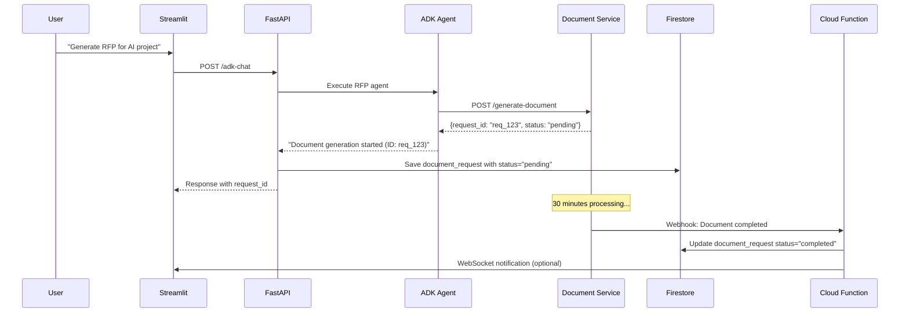

# Firestore Architecture & Memory Management

## 🗄️ Enhanced Database Schema Design

### Collection Structure Overview

```
firestore/
├── conversations/           # Chat conversations
├── messages/               # Individual chat messages  
├── document_requests/      # RFP/Document generation requests
├── adk_sessions/          # Persistent ADK session storage
├── user_profiles/         # User preferences and settings
└── system_metadata/       # Application configuration
```

## 📊 Detailed Collection Schemas

### 1. **conversations** Collection
```json
{
  "id": "conv_uuid",
  "user_id": "user_123",
  "title": "Research Discussion",
  "agent_type": "academic-research|rfp-generation|general-chat",
  "created_at": "2024-01-15T10:30:00Z",
  "updated_at": "2024-01-15T11:45:00Z",
  "message_count": 12,
  "model_settings": {
    "model_name": "academic-research",
    "temperature": 0.7,
    "max_tokens": 2048
  },
  "session_metadata": {
    "adk_session_id": "adk_session_uuid",
    "last_activity": "2024-01-15T11:45:00Z",
    "total_tokens_used": 1500
  },
  "tags": ["research", "literature-review"],
  "status": "active|archived|deleted"
}
```

### 2. **messages** Collection
```json
{
  "id": "msg_uuid",
  "conversation_id": "conv_uuid", 
  "role": "user|assistant|system",
  "content": "Message text content",
  "timestamp": "2024-01-15T10:30:00Z",
  "metadata": {
    "attachments": [
      {
        "filename": "research_paper.pdf",
        "url": "gs://bucket/files/uuid.pdf",
        "type": "application/pdf",
        "size": 2048576
      }
    ],
    "model_version": "academic-research-v1.2",
    "processing_time_ms": 1500,
    "token_count": 150,
    "agent_events": [...], // Raw ADK events for debugging
    "related_request_id": "doc_req_uuid" // Link to document requests
  },
  "edited": false,
  "parent_message_id": null // For message threading
}
```

### 3. **document_requests** Collection (New)
```json
{
  "id": "doc_req_uuid",
  "user_id": "user_123",
  "conversation_id": "conv_uuid", // Link back to chat
  "message_id": "msg_uuid", // Originating message
  "request_type": "rfp|proposal|report|summary",
  "project_details": {
    "project_name": "AI Research Initiative",
    "opportunity_id": "opp_12345",
    "client_email": "client@company.com",
    "deadline": "2024-02-01T00:00:00Z"
  },
  "document_config": {
    "template_type": "technical_rfp",
    "sections": ["executive_summary", "technical_approach", "timeline"],
    "format": "pdf|docx",
    "length": "detailed|summary"
  },
  "processing_status": {
    "status": "pending|in_progress|completed|failed",
    "created_at": "2024-01-15T10:30:00Z",
    "started_at": "2024-01-15T10:35:00Z",
    "completed_at": "2024-01-15T11:05:00Z",
    "progress_percentage": 75,
    "current_stage": "content_generation",
    "estimated_completion": "2024-01-15T11:10:00Z"
  },
  "output_details": {
    "document_url": "gs://bucket/generated/doc_uuid.pdf",
    "preview_url": "gs://bucket/previews/doc_uuid_preview.png",
    "word_count": 5000,
    "page_count": 15,
    "generation_metadata": {
      "model_used": "gemini-2.5-pro",
      "total_tokens": 8000,
      "processing_time_minutes": 28
    }
  },
  "webhook_logs": [
    {
      "timestamp": "2024-01-15T10:35:00Z",
      "status": "started",
      "details": "Document generation initiated"
    },
    {
      "timestamp": "2024-01-15T11:05:00Z", 
      "status": "completed",
      "details": "PDF generated successfully"
    }
  ]
}
```

### 4. **adk_sessions** Collection (New - Persistent Storage)
```json
{
  "id": "adk_session_uuid",
  "user_id": "user_123",
  "conversation_id": "conv_uuid",
  "agent_name": "academic-research",
  "session_state": {
    "context_history": [...], // Compressed conversation context
    "agent_memory": {...}, // Agent-specific state
    "tool_states": {...}, // Sub-agent states
    "user_preferences": {
      "research_focus": "machine_learning",
      "citation_style": "apa",
      "detail_level": "comprehensive"
    }
  },
  "created_at": "2024-01-15T10:30:00Z",
  "last_accessed": "2024-01-15T11:45:00Z",
  "access_count": 15,
  "total_tokens": 5000,
  "status": "active|hibernated|expired",
  "expiry_date": "2024-01-22T10:30:00Z", // 7 days default
  "backup_frequency": "daily|weekly|never"
}
```

### 5. **user_profiles** Collection (New)
```json
{
  "id": "user_123",
  "email": "user@domain.com",
  "preferences": {
    "default_agent": "academic-research",
    "ui_theme": "dark|light",
    "notification_settings": {
      "document_completion": true,
      "session_expiry_warning": true
    }
  },
  "usage_analytics": {
    "total_conversations": 50,
    "total_documents_generated": 5,
    "favorite_agent": "academic-research",
    "avg_session_length_minutes": 25
  },
  "subscription": {
    "plan": "free|pro|enterprise",
    "tokens_used_this_month": 10000,
    "token_limit": 50000,
    "document_requests_this_month": 3,
    "document_limit": 10
  },
  "created_at": "2024-01-01T00:00:00Z",
  "last_login": "2024-01-15T11:45:00Z"
}
```

## 🧠 Memory Management Strategy

### ADK Session Persistence

#### **Hybrid Approach: In-Memory + Firestore Backup**

```
┌─────────────────┐    Backup Every    ┌─────────────────┐
│  ADK Server     │    5 minutes       │   Firestore     │
│  (In-Memory)    │◄──────────────────►│ (adk_sessions)  │
│                 │    or 10 messages  │                 │
│ • Fast Access   │                    │ • Persistent    │
│ • Real-time     │    Restore on      │ • Searchable    │
│ • Agent Context │    Server Restart  │ • Analytics     │
└─────────────────┘                    └─────────────────┘
```

#### **Session Lifecycle Management:**

1. **Active Sessions** (0-2 hours)
   - Kept in ADK server memory
   - High-frequency access
   - Real-time agent interactions

2. **Hibernated Sessions** (2-24 hours)
   - Compressed and stored in Firestore
   - Restored on demand
   - Reduced memory footprint

3. **Archived Sessions** (24+ hours)
   - Full backup in Firestore
   - ADK memory cleared
   - Restore with slight delay

### Memory Optimization Strategies

#### **Context Compression**
```python
# Compress long conversations
def compress_session_context(messages, max_tokens=4000):
    if total_tokens(messages) > max_tokens:
        # Keep recent messages + summarize older ones
        recent = messages[-10:]  # Last 10 messages
        older = messages[:-10]
        summary = generate_summary(older)
        return [summary] + recent
    return messages
```

#### **Smart Backup Triggers**
- **Time-based**: Every 5 minutes
- **Activity-based**: Every 10 messages
- **Memory-based**: When session > 50MB
- **User-triggered**: Manual save points

## 🔄 Document Request Workflow

### RFP Generation Flow



## 🏗️ Enhanced Firestore Architecture

### Collection Relationships

```
conversations (1) ──────── (N) messages
     │                         │
     │                         │
     └── (1:1) ─── adk_sessions │
                                │
                                └── (1:N) ─── document_requests
                                                    │
                                                    └── (N:1) ─── user_profiles
```

### Indexing Strategy

```javascript
// Composite indexes for efficient queries
conversations: [
  ["user_id", "updated_at", "desc"],
  ["agent_type", "status", "updated_at"],
  ["user_id", "agent_type", "updated_at"]
]

messages: [
  ["conversation_id", "timestamp", "asc"],
  ["user_id", "timestamp", "desc"],
  ["conversation_id", "role", "timestamp"]
]

document_requests: [
  ["user_id", "created_at", "desc"],
  ["status", "created_at", "asc"],
  ["user_id", "request_type", "status"],
  ["conversation_id", "created_at", "desc"]
]

adk_sessions: [
  ["user_id", "last_accessed", "desc"],
  ["status", "expiry_date", "asc"],
  ["agent_name", "user_id", "last_accessed"]
]
```

## 🔧 Session Persistence Best Practices

### 1. **Tiered Storage Strategy**

#### **Hot Tier** (ADK In-Memory)
- **Duration**: 0-2 hours
- **Size Limit**: 100MB per session
- **Use Case**: Active conversations
- **Performance**: < 100ms response

#### **Warm Tier** (Firestore Cache)
- **Duration**: 2-24 hours  
- **Compression**: 70% size reduction
- **Use Case**: Recent conversations
- **Performance**: < 500ms restore

#### **Cold Tier** (Firestore Archive)
- **Duration**: 24+ hours
- **Compression**: 90% size reduction
- **Use Case**: Historical data
- **Performance**: < 2s restore

### 2. **Memory Management Rules**

```python
# Session size limits
MAX_ACTIVE_SESSIONS_PER_USER = 3
MAX_SESSION_SIZE_MB = 100
MAX_CONTEXT_MESSAGES = 50
SESSION_TIMEOUT_HOURS = 2

# Cleanup policies
HIBERNATE_AFTER_HOURS = 2
ARCHIVE_AFTER_HOURS = 24
DELETE_AFTER_DAYS = 30
```

### 3. **Context Preservation**

```python
# What to persist in ADK sessions
session_context = {
    "conversation_summary": "Compressed summary of discussion",
    "user_intent": "Current user goal/objective", 
    "research_focus": "Active research areas",
    "document_preferences": "User's document generation preferences",
    "agent_memory": {
        "mentioned_papers": [...],
        "research_topics": [...],
        "user_expertise_level": "beginner|intermediate|expert"
    }
}
```

## 🚀 Scalability Considerations

### **Horizontal Scaling**
- **ADK Sessions**: Distribute across multiple ADK server instances
- **Firestore**: Auto-scaling with regional replication
- **Session Affinity**: Route users to same ADK instance when possible

### **Performance Optimization**
- **Connection Pooling**: Reuse Firestore connections
- **Batch Operations**: Group multiple writes
- **Caching Layer**: Redis for frequently accessed data
- **Async Processing**: Non-blocking document generation

### **Cost Optimization**
- **Firestore Reads**: Minimize with smart caching
- **Document Storage**: Use Cloud Storage for large files
- **Session Cleanup**: Automated garbage collection
- **Compression**: Reduce storage costs by 70%

## 🔄 Future Agent Integration

### Multi-Agent Support Schema

```json
// Enhanced conversation for multiple agents
{
  "agent_history": [
    {
      "agent_name": "academic-research",
      "session_id": "adk_session_1", 
      "messages_range": [1, 15],
      "handoff_context": "User wants RFP generation"
    },
    {
      "agent_name": "rfp-generation",
      "session_id": "adk_session_2",
      "messages_range": [16, 25],
      "handoff_context": "Generate technical proposal"
    }
  ],
  "active_agent": "rfp-generation",
  "agent_transitions": 2
}
```

## 📈 Analytics & Monitoring

### Performance Metrics
- **Session Restore Time**: Track hibernation/restore performance
- **Memory Usage**: Monitor ADK server memory consumption
- **Document Processing**: Track generation success rates
- **User Engagement**: Conversation length and frequency

### Health Monitoring
```python
# Key metrics to track
session_metrics = {
    "active_sessions": 150,
    "hibernated_sessions": 500,
    "avg_session_size_mb": 25,
    "restore_success_rate": 0.99,
    "avg_restore_time_ms": 300
}
```

## 🔐 Data Governance

### **Data Retention Policies**
- **Messages**: 1 year for free users, unlimited for pro
- **ADK Sessions**: 30 days active, then archived
- **Document Requests**: 90 days with generated files
- **Analytics**: 2 years aggregated data

### **Privacy & Security**
- **Encryption**: All data encrypted at rest
- **Access Control**: User-scoped data isolation
- **Audit Logs**: Track all data access and modifications
- **GDPR Compliance**: User data export and deletion

## 🎯 Implementation Priorities

### **Phase 1: Enhanced Schema**
1. Add `document_requests` collection
2. Extend `conversations` with agent metadata
3. Create `adk_sessions` for persistence

### **Phase 2: Session Management**
1. Implement hibernation/restore logic
2. Add session size monitoring
3. Create cleanup automation

### **Phase 3: Advanced Features**
1. Multi-agent conversation support
2. Advanced analytics dashboard
3. Performance optimization

This architecture provides a robust foundation for scaling your chatbot system while maintaining excellent performance and user experience. The dual-tier approach balances speed with persistence, and the enhanced schema supports future agent integrations seamlessly.
